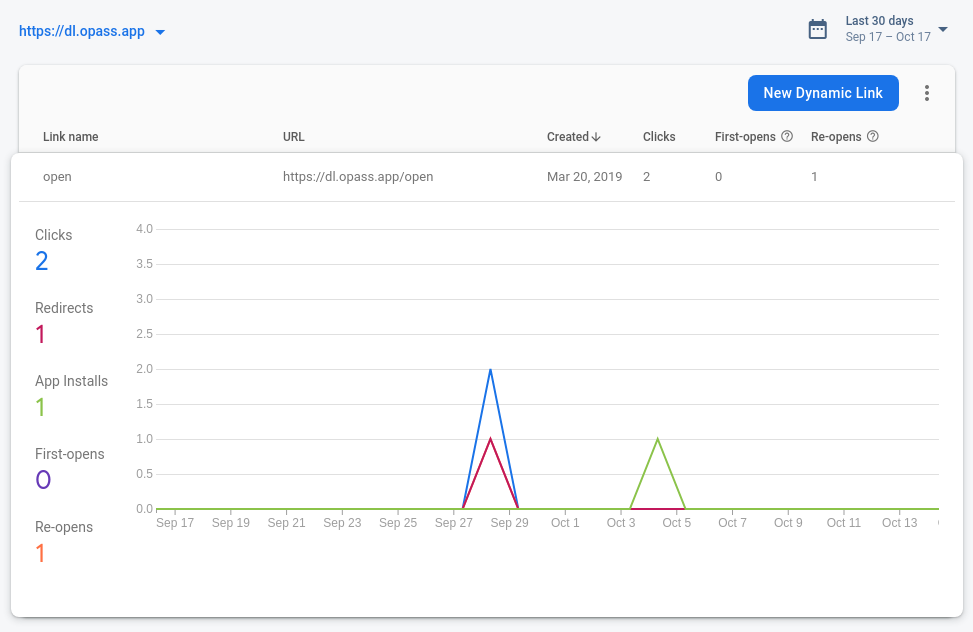
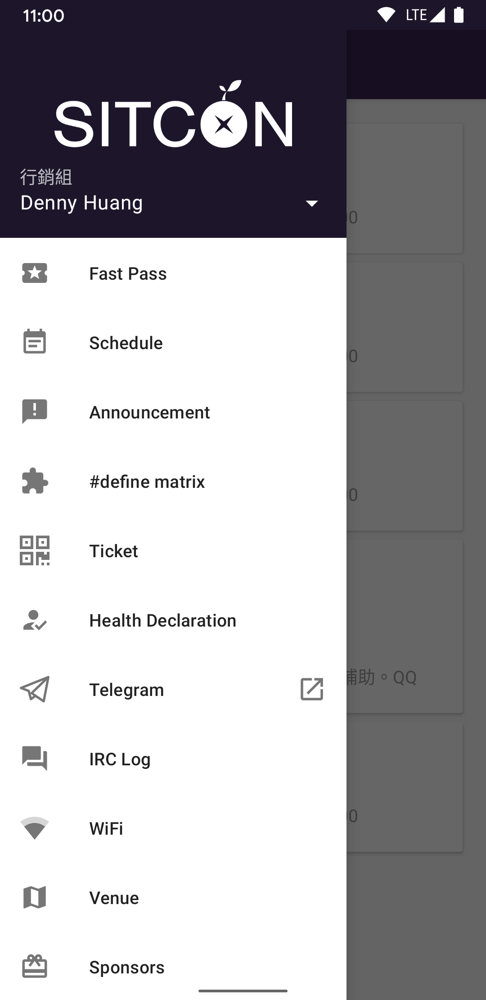
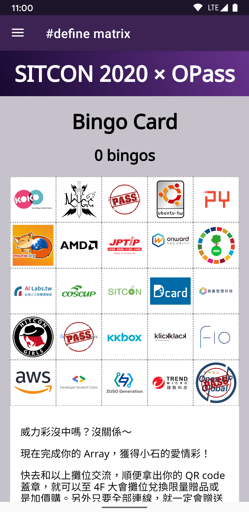
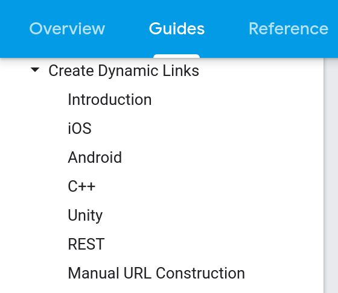
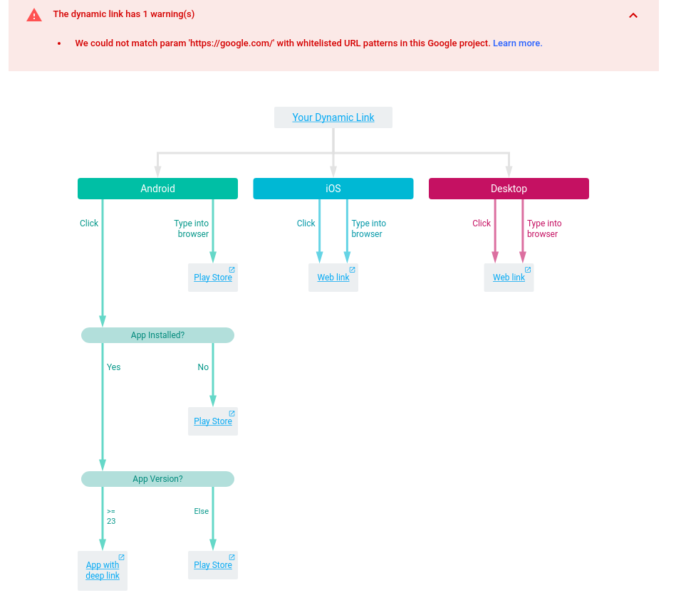

title: 咻的～滑進 App - 透過 Firebase Dynamic Link 順暢導入使用者
output: index.html

--

<h1 style="font-size: 48px">
  咻的～滑進 App -  
  透過 Firebase Dynamic Link  
  順暢導入使用者
</h1>
 
 
## GDG DevFest Taiwan 2020
## Denny Huang
## 2020/10/17

--

### Slide link
<h1 style="font-size: 52px">
https://denny.one/devfest2020/
</h1>

--

### Online Q & A

  

## https://sli.do/firebase

--

 
<h2 style="font-size: 60px">
  <b>Denny Huang</b>
</h2>

* OPass project coordinator

* SITCON co-founder, Chief Coordinator of 2013, 2014

* 雷亞遊戲 Rayark Inc.

* [About me](https://denny.one)

--

<h1 style="font-size: 62px">
  Firebase Dynamic Links / Deep Link
</h1>

--

  

## [Firebase Dynamic Links](https://firebase.google.com/docs/dynamic-links)

--

   
  追蹤使用者安裝來源

--

  <video height="600px" controls>
    <source src="webex.mp4" type="video/mp4">
  </video>

--

 

  

 
## https://opass.app/

--

<h1 style="font-size: 60px">
  https://hackmd.io/@OPass
</h1>

--

  
  

--

  
  

--

  <video height="500px" controls>
    <source src="installed.mp4" type="video/mp4">
  </video>
  <video height="500px" controls>
    <source src="not-installed.mp4" type="video/mp4">
  </video>
   
  <h2>　installed　　　not installed</h2>

--

### 信件內連結
 
 
 
`https://opass.app/r/SITCON_2020/40440179-278d-4c38-aa8f-bafadcf76f41`

--

 

  

--

- `https://dl.opass.app/`

- `https://opass.app/r/SITCON_2020/40440179-278d-4c38-aa8f-bafadcf76f41`

- ` https://dl.opass.app/?link=https%3A%2F%2Fopass.app%2Fopen%2F%3Fevent_id%3DSITCON_2020%26token%3D40440179-278d-4c38-aa8f-bafadcf76f41&isi=1436417025&ibi=app.opass.ccip&apn=app.opass.ccip&amv=40 `

--

# [Debugging](https://firebase.google.com/docs/dynamic-links/debug)
 
## `?d=1`

--

  
  https://dl.opass.app/open?d=1

--

### Link for user

- `https://opass.app/r/SITCON_2020/40440179-278d-4c38-aa8f-bafadcf76f41`

### Deep Link

- `https://opass.app/open/?event_id=SITCON_2020&token=40440179-278d-4c38-aa8f-bafadcf76f41`

--

### Dynamic Link

- ` https://dl.opass.app/?`

  `link=https%3A%2F%2Fopass.app%2Fopen%2F%3Fevent_id%3DSITCON_2020%26token%3D40440179-278d-4c38-aa8f-bafadcf76f41&`

  `isi=1436417025&`

  `ibi=app.opass.ccip&`

  `apn=app.opass.ccip&`

  `amv=40 `

--

# [Parameters](https://firebase.google.com/docs/dynamic-links/create-manually)

--

  <video height="600px" controls>
    <source src="not-install-web.mp4" type="video/mp4">
  </video>

--

### Social Meta Tag parameters

   
  
  

--

# Analytics parameters

--

### iOS 14

  

- [#5893](https://github.com/firebase/firebase-ios-sdk/issues/5893)

- [#5905](https://github.com/firebase/firebase-ios-sdk/issues/5893)

- Version 6.28.0 - July 14, 2020

- [iOS 14 剪貼簿竊資恐慌，隱私與便利的兩難](https://medium.com/zrealm-ios-dev/8a04443024e2)

--

# Q & A

--

<h1 style="font-size: 72px">
  Thanks for listening!
</h1>

   

  

<h2 style="font-size: 18px">
本投影片採用<a href="http://creativecommons.org/licenses/by-sa/3.0/tw/" target="_blank">創用 CC「姓名標示—相同方式分享 3.0 台灣」授權條款</a>
</h2>

